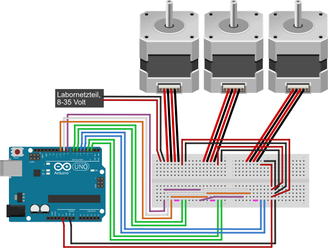

## Tri-A4988

### Kurzzusammenfassung

Diese Bibliothek ermöglicht es, drei Schrittmotoren mit A4988-Treibern gleichzeitig und synchron zueinander anzusteuern. Die Bibliothek ist für die Verwendung mit der Arduino-IDE geschrieben und wurde unter der IDE-Version 1.8.9 getestet.

---

### Befehlübersicht

Um die Bibliothek einzubinden wird folgender Befehl genutzt:

```C++
#include <A4988.h>
```

Anschließend muss folgender Befehl einmal aufgerufen werden, um alle weiteren Funktionen zu initialisieren:

```C++
A4988.Init();
```

Die Drehgeschwindigkeit kann angepasst werden mit folgenden Befehl. Der Zahlenwert gibt dabei die halbe Zeitdauer in Mikrosekunden für jeden Schritt an, der Standardwert ist `2000`.

```C++
A4988.Interval();
```

Um die Auflösung des Mikrosteppings anzupassen, wird folgender Befehl genutzt. Es sind die Werte `1`, `2`, `4`, `8` und `16` zulässig, der Standardwert ist `1`.

```C++
A4988.Microsteps();
```

Mit diesem Befehl können die drei Schrittmotoren synchron zueinander angesteuert werden. Die Drehungsrichtung wird durch das Vorzeichen der Zahl festgelegt. Der Betrag der Zahl gibt die Anzahl der (Mikro-) Schritte an.

```C++
A4988.Rotate(x, y, z);
```

---

### Protoboardaufbau



---

### Weiteres

[Datenblatt A4988](https://components101.com/sites/default/files/component_datasheet/A4988%20Stepper%20Motor%20Driver%20Module.pdf)

[Starthardware.org-Anleitung](https://starthardware.org/arduino-a4988-nema17/)
